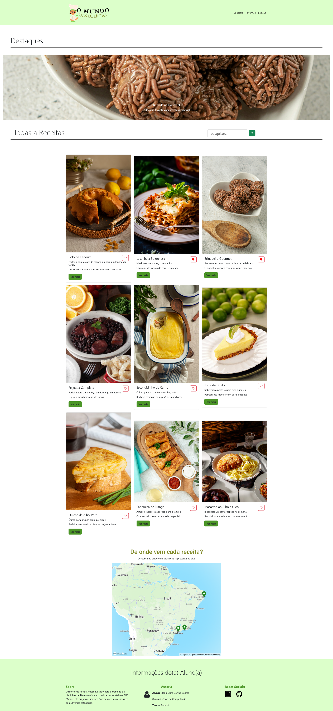
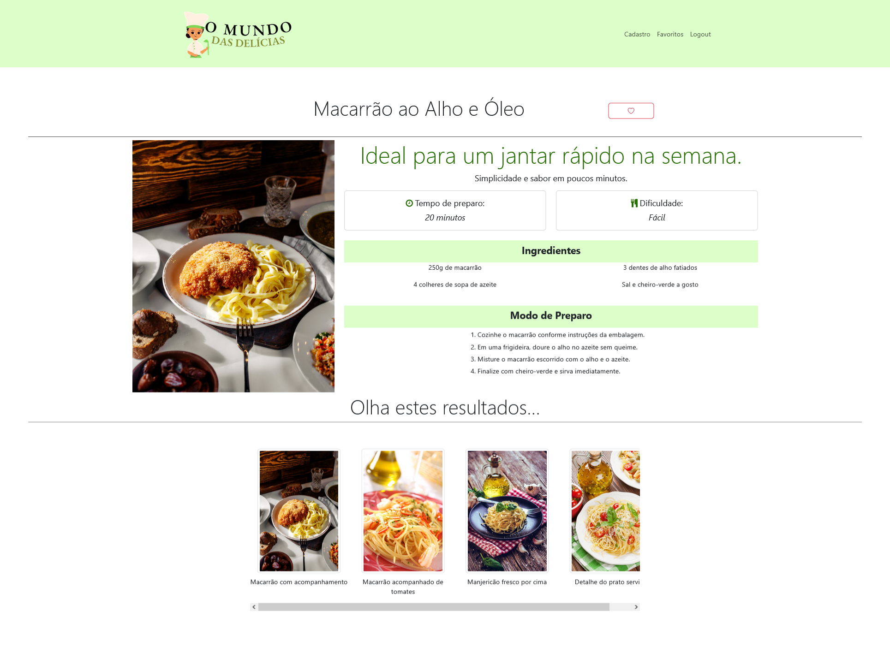
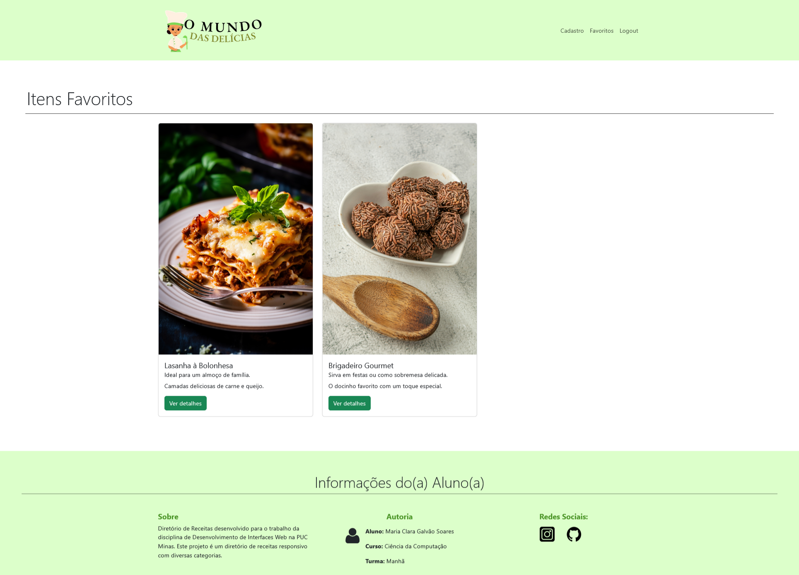
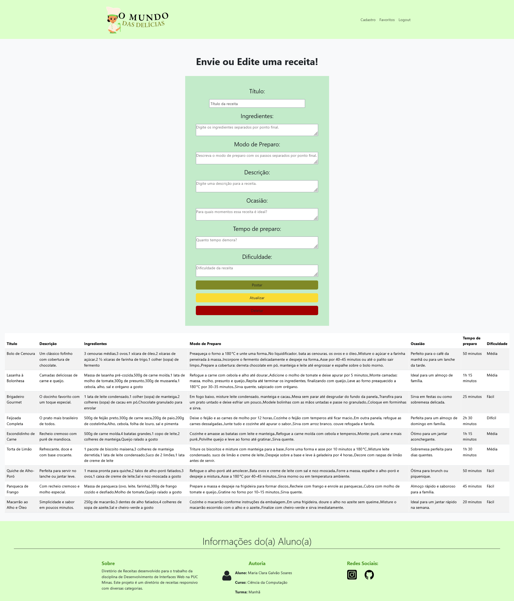

# Trabalho-Pratico-2

Este é um trabalho feito para a disciplina de Desenvolvimento de Interfaces Web, no primeiro período do curso de Ciência da Computação.

<b>Breve descrição sobre o projeto:</b> O projeto consiste em um diretório de receitas que apresenta uma área de destaques e uma seção de últimos posts, os quais podem ser favoritados por meio de um botão. Além disso, o site conta com uma barra de pesquisa que direciona o usuário diretamente para a receita selecionada, caso ela exista.

A plataforma permite a criação de diferentes contas de usuário, possibilitando que cada pessoa salve suas receitas favoritas. O sistema também possui um perfil de administrador, responsável por cadastrar, editar e excluir receitas. Ao final da página inicial, é exibido um mapa que indica a origem de cada receita cadastrada.

## Como abrir o site em seu computador?
- Primeiro abra o Projeto no Terminal
- Digite: 
     - npm install json-server
     - npm start
- Após ter sucesso, acesse: http://localhost:3000/

## Imagens do Projeto

#### Página Inicial:

#### Página Detalhes:

#### Página Favoritos:

#### Página Cadastro:

